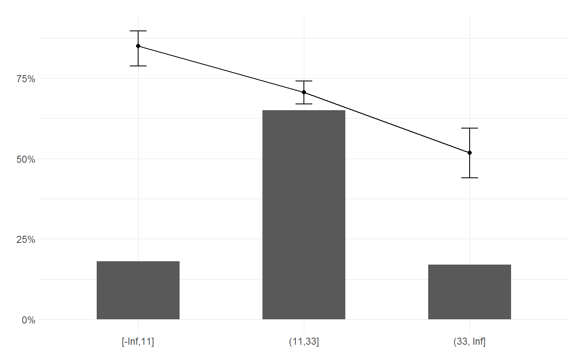

<!-- README.md is generated from README.Rmd. Please edit that file -->
[](https://travis-ci.org/jbkunst/irks) [](https://ci.appveyor.com/project/jbkunst/irks)

irks
====

Is a set of tools for credit risk modelling.

Installation
------------

You can install the released version of irks from [CRAN](https://CRAN.R-project.org) with:

``` r
install.packages("irks")
```

And the development version from [GitHub](https://github.com/) with:

``` r
# install.packages("devtools")
devtools::install_github("jbkunst/irks")
```

Descriptive
-----------

``` r
library(irks)
library(dplyr)
#> 
#> Attaching package: 'dplyr'
#> The following objects are masked from 'package:stats':
#> 
#>     filter, lag
#> The following objects are masked from 'package:base':
#> 
#>     intersect, setdiff, setequal, union
data("german_credit")

german_credit <- select(german_credit, good_bad, status_of_existing_checking_account,
                        duration_in_month, savings_account_or_bonds, credit_amount,
                        purpose, age_in_years)

duni <- describe(german_credit)
duni
#> $numeric
#> # A tibble: 4 x 10
#>   variable      n_unique na_percent   min     mean median    max  Variance
#>   <chr>            <dbl>      <dbl> <dbl>    <dbl>  <dbl>  <dbl>     <dbl>
#> 1 good_bad            2.         0.    0.    0.700 1.00e0     1.   2.10e-1
#> 2 duration_in_~      33.         0.    4.   20.9   1.80e1    72.   1.45e+2
#> 3 credit_amount     921.         0.  250. 3271.    2.32e3 18424.   7.97e+6
#> 4 age_in_years       53.         0.   19.   35.5   3.30e1    75.   1.29e+2
#> # ... with 2 more variables: skewness <dbl>, kurtosis <dbl>
#> 
#> $non_numeric
#> # A tibble: 3 x 4
#>   variable                            n_unique na_percent   hhi
#>   <chr>                                  <dbl>      <dbl> <dbl>
#> 1 status_of_existing_checking_account       4.         0. 0.307
#> 2 savings_account_or_bonds                  5.         0. 0.414
#> 3 purpose                                  10.         0. 0.189

dbiv <- describe_bivariate(german_credit, target = good_bad, verbose = FALSE)

arrange(dbiv, desc(iv))
#> # A tibble: 6 x 11
#>   variable                   iv   hhi n_unique class   monotonous na_level
#>   <chr>                   <dbl> <dbl>    <int> <chr>   <lgl>      <chr>   
#> 1 status_of_existing_ch~ 0.635  0.356        3 charac~ NA         (Missin~
#> 2 duration_in_month      0.229  0.484        3 integer TRUE       (Missin~
#> 3 savings_account_or_bo~ 0.189  0.585        2 charac~ NA         (Missin~
#> 4 credit_amount          0.175  0.335        4 integer FALSE      (Missin~
#> 5 purpose                0.142  0.523        2 charac~ NA         (Missin~
#> 6 age_in_years           0.0732 0.692        2 integer TRUE       (Missin~
#> # ... with 4 more variables: separate_missing <lgl>, dict <list>,
#> #   summary <list>, binnig <list>
```

Binning
-------

``` r
x <- german_credit$duration_in_month
y <- german_credit$good_bad

bin <- binning(x, y)
bin
#> $dict
#> # A tibble: 4 x 1
#>   breaks
#>    <dbl>
#> 1  -Inf 
#> 2    11.
#> 3    33.
#> 4   Inf 
#> 
#> $summary
#> # A tibble: 3 x 13
#>   x             n percent target_n target_rate target_percent non_target_n
#>   <fct>     <int>   <dbl>    <dbl>       <dbl>          <dbl>        <dbl>
#> 1 [-Inf,11]   180   0.180     153.       0.850          0.219          27.
#> 2 (11,33]     650   0.650     459.       0.706          0.656         191.
#> 3 (33, Inf]   170   0.170      88.       0.518          0.126          82.
#> # ... with 6 more variables: non_target_percent <dbl>, odds <dbl>,
#> #   woe <dbl>, iv <dbl>, lower <dbl>, upper <dbl>
#> 
#> $separate_missing
#> [1] FALSE
#> 
#> $iv
#> [1] 0.2292961
#> 
#> $hhi
#> [1] 0.4838
#> 
#> $monotonous
#> [1] TRUE
#> 
#> $na_level
#> [1] "(Missing)"
#> 
#> $class
#> [1] "integer"
#> 
#> attr(,"class")
#> [1] "binning"

plot(bin)
```



Model helpers
-------------

### `var_importance`

``` r
german_credit <- mutate_if(german_credit, is.character, as.factor)

rf <- randomForest::randomForest(factor(good_bad) ~ ., data = german_credit)
var_importance(rf)
#> # A tibble: 6 x 2
#>   variable                            importance
#>   <chr>                                    <dbl>
#> 1 credit_amount                            107. 
#> 2 age_in_years                              79.6
#> 3 duration_in_month                         65.9
#> 4 status_of_existing_checking_account       57.9
#> 5 purpose                                   52.5
#> 6 savings_account_or_bonds                  31.2

rrf <- RRF::RRF(factor(good_bad) ~ ., data = german_credit)
var_importance(rrf)
#> # A tibble: 6 x 2
#>   variable                            importance
#>   <chr>                                    <dbl>
#> 1 credit_amount                            127. 
#> 2 age_in_years                              86.2
#> 3 duration_in_month                         66.1
#> 4 status_of_existing_checking_account       60.9
#> 5 purpose                                   49.4
#> 6 savings_account_or_bonds                  29.7

suppressMessages(library(partykit))
ct <- ctree(Species ~ ., data = iris)
ct_rules(ct)
#>   node                                                          rule
#> 1    2                                           Petal.Length <= 1.9
#> 2    5 Petal.Length > 1.9 & Petal.Width <= 1.7 & Petal.Length <= 4.8
#> 3    6  Petal.Length > 1.9 & Petal.Width <= 1.7 & Petal.Length > 4.8
#> 4    7                        Petal.Length > 1.9 & Petal.Width > 1.7
```
